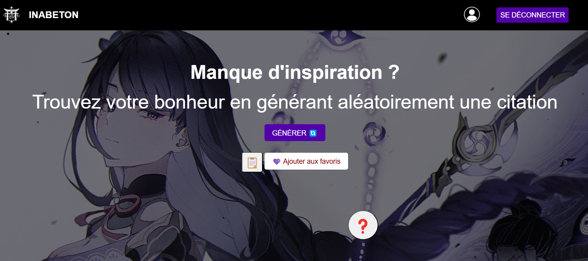

# Semaine 7 - Projet “Inabeton” (Générateur de citations en JS + Générater en JS/PHP, en bonus, un petit jeu "Le pendu")

# 1 - Références 

Durant ce projet, plusieurs ressources en ligne m'ont aidé à comprendre et implémenter certaines fonctionnalités. J'ai suivi des tutoriels, exploré des forums et testé des snippets (codepen) de code trouvés sur divers sites.

# 1.1 - Sites utilisés

YouTube : Tutoriels en vidéo, notamment CodingNepal (un tuto sur le jeu du pendu en anglais) et AK DEV  (playlist)

(Plusieurs vidéos comme :

https://www.youtube.com/watch?v=X51KOJKrofU (API)

https://www.youtube.com/watch?v=5L9UhOnuos0 (SignUP)

https://www.youtube.com/watch?v=UTNK9srjGt8&list=PL-h5aNeRKouEIsAFGeS-yhw97mQumSak-&index=14 (Shopping Cart avec BCP de PHP)

https://www.youtube.com/watch?v=Aeo41kddtwY (Admin Panel)

CodePen : Inspiration pour la mise en page et certaines animations CSS.

Stack Overflow : Le sauveur de ce projet, 90% des erreurs sont fix grâce au forum.

Tutoriels développement web :
Créer une API en PHP.

AdminPanel avec gestion des utilisateurs. (Vidéo)

Fonction Clipboard pour copier du texte.

Système de vérification des rôles (Admin/User).

Gestion des cookies et sessions. ‘Vidéo)

Système de connexion et d'inscription. (Video)

# 2 - Documentation technique

# 2.1 - PHP

A - admin.php

Gère l'interface d'administration du site, permettant de visualiser et de modifier les citations enregistrées. On vérif le role avec un “if (!isset($_SESSION['user_id']) || $_SESSION['role'] !== 'admin') {
die("Tié pas un copaing.");

B - adminAjout.php

Permet l'ajout de nouvelles citations via l'interface d'administration.

C - ajoutCitation.php

Script backend permettant d'ajouter une citation à la base de données via un formulaire utilisateur.

D - api.php

Gère les requêtes API pour obtenir aléatoirement une citation stockée dans la base de données.

E - apiFavori.php

Retourne les citations favorites d'un utilisateur connecté.

F - config.php

Fichier de configuration contenant les paramètres de connexion à la base de données.

G - connexion.php

Gère l'authentification des utilisateurs avec une vérification des identifiants.

H - deconnexion.php

Permet à un utilisateur de se déconnecter en supprimant sa session.

I - favoris.php

Gère l'ajout et la suppression des citations favorites pour un utilisateur.

J - favorisData.php

Récupère et affiche les citations favorites d'un utilisateur sous format JSON.

K - header.php

Fichier incluant l'en-tête du site avec la navigation commune à toutes les pages.

L - profilUtilisateur.php

Affiche les informations du profil utilisateur ainsi que ses citations favorites.

M - sInscrire.php

Gère l'inscription des nouveaux utilisateurs avec validation des données.

N - suppCitation.php

Permet à un administrateur de supprimer une citation.

O - suppFavori.php

Permet à un utilisateur de retirer une citation de ses favoris.

P - index.php

Page d'accueil du site affichant une citation aléatoire et les options d'interaction.

# 2.2 - JS

A - admin

Gère l'interface d'administration pour l'ajout et la suppression des citations.

B - pendu

Implémente un mini-jeu du pendu permettant de deviner des mots. (Merci à CodingNepal)

C - penduListe

Stocke les mots utilisés dans le jeu du pendu. (Merci à CodingNepal)

D - random.js

Gestion du menu burger : permet d'ouvrir et de fermer le menu sur mobile.

Génération des citations : récupère une citation via api.php et l'affiche.

Ajout aux favoris : permet d'ajouter et de retirer une citation des favoris en envoyant une requête à favoris.php.
